**Background:**

Customers use real time streaming frameworks handing large volumes of
streaming data from multiple channels. This usually needs to maintain,
set up and administer stream layer and processing layer which is time
consuming.

**Purpose:**

This guide helps to implement real streaming processing framework with
MSK cluster on AWS using spark on EMR with minimal and seamless setup.

**Introduction:**

Using MSK which is the AWS Managed Service for Kafka and AWS EMR which
is the AWS Managed Hadoop Framework, we can build a stream processing
framework.

MSK and EMR handle the setup and administration and we can focus on the
processing logic to get handled.

**Architecture**:

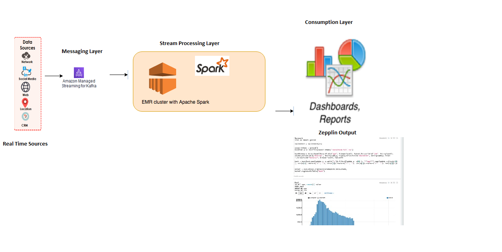

The typical architecture which captures data from various real time
sources and is sent to the Messaging layer which is served by MSK. And
further processed by Spark on EMR.

The first layer is the Data Source layer where the real time sources
capture the information.

The intermediate block is the MSK which helps to send data between
sources to the Real time processing platform.

-   Data Producer sends records to the MSK using Kafka library using
    producer API.

-   The intermediate layer is the MSK Layer which pushed these events to
    the further downstream systems. Kafka Topic partition
    replication/leader selection are automatically handled by the AWS
    MSK cluster. MSK is also responsible to retain the cluster and data
    in case of the broker failure and automatically recover from it and
    ensure the partition is still available to be read by consumers.

-   Then the last layer is the data processing layer, which is Spark on
    the EMR cluster which could process the data in real time and send
    to the visualization layer.

**Use case:**

To demonstrate connectivity between MSK with EMR Spark, a simple example
setting up EMR cluster with spark streaming and MSK cluster is show
cased. Existing Spark word count example is used to consume the data
from MSK topics. The final output is showcased on spark console and
zeppelin.

**Activities**

Now let's see how to set up this kind of framework on AWS. Main steps to
implement a streaming application on AWS on EMR spark and MSK are as
below

1.  Messaging Platform :- We will leverage MSK for this.

2.  Producer framework:- We will stub this using console Kafka Producer
    to send streaming data.

3.  Processing Framework:- We would leverage EMR spark and try to make
    some config changes to connect to MSK cluster and run a simple word
    count example which can print real time word count.

4.  Visualization:- We have showcased on the console and also on
    zeppelin to print real time word counts.

**Workshop Activities**

The below steps would guide in setting up and configuring the EMR and
MSK cluster to communicate with each other and how to run the simple
word count application.

1.  Setting up the MSK cluster.

2.  Create EMR cluster with spark and zeppelin.

3.  Open ports and update security groups between Kafka and EMR Cluster

4.  Provide access for EMR cluster to operate on MSK

5.  Install kafka client on EMR cluster

6.  Create topic. Doing a sample test for connectivity.

7.  Download kafka libraries.

8.  Open zeppelin and configure interpreter

9.  Run the streaming code in zeppelin

10. Send records from Producer

11. Alternative to zeppelin submit via spark shell

12. Verify the logs for output.

13. Cloud formation template to set up EMR with spark/zeppelin and Kafka
    bootstrap scripts.

### **Setting up MSK Cluster**

> First step is to create MSK cluster. Below steps outline how to create
> MSK though AWS console.
>
> Key in the name and leave VPC as default. Use Kafka 2.1.0 version
>
> 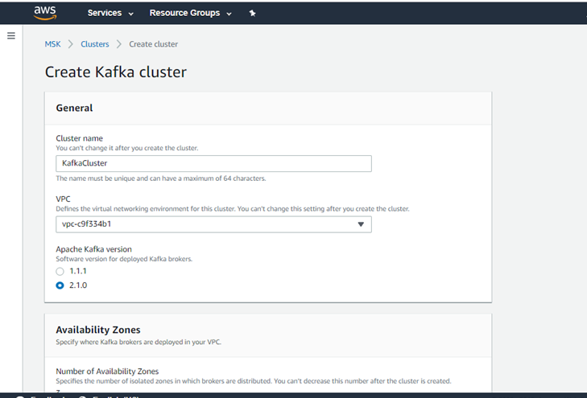
>
> Select the subnet and AZs.
>
> 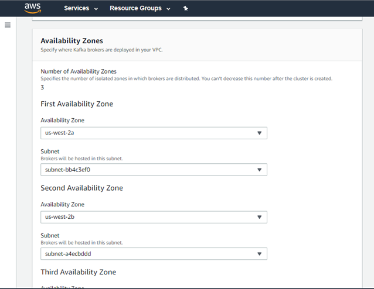
>
> Select no of brokers per AZ .
>
> 
>
> 

Leave the advanced details default. Click on create cluster. Wait for
the MSK cluster to be created. This may take few minutes.

### **Setting up EMR cluster with spark/Zepplin enabled.**

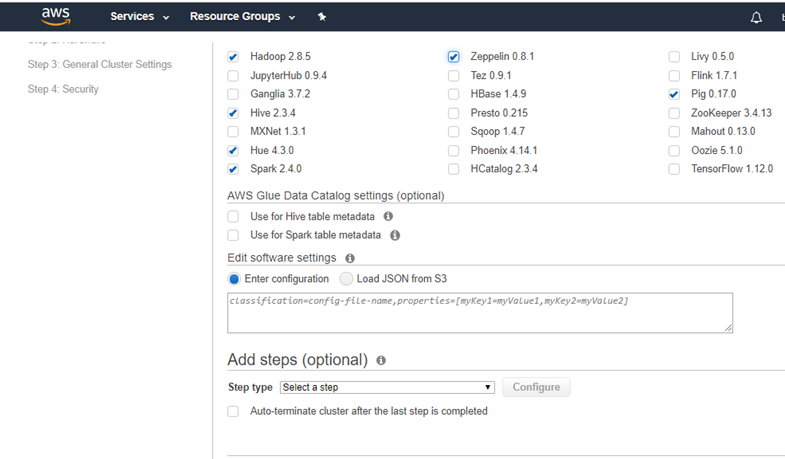

You can create it using cli or console also Ensure you select spark and
zeppelin in advanced configurations while creating the cluster

Remember the security key, this would be needed in the subsequent steps
while logging into the cluster.

### **Open ports and update security groups**

> Access the MSK cluster link and click on Security Groups
>
> 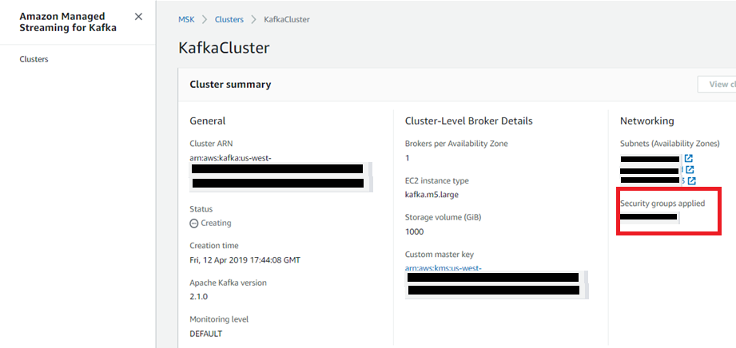

Go to EMR console and get the Security group (SG) of EMR Master.

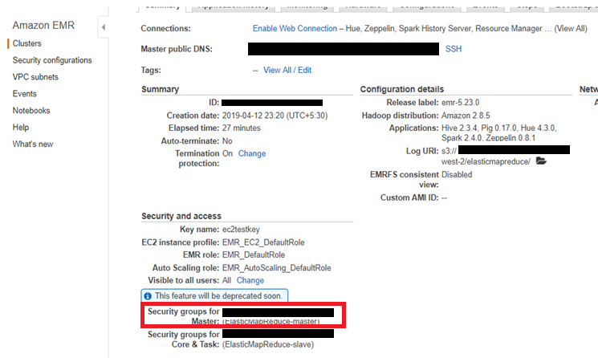

Update the Security Group as below entering all traffic from source as
EMR SG name for MSK SG.

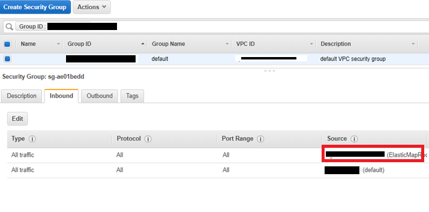

Repeat the same steps for EMR cluster.

In EMR Master Security Group add Kafka cluster Security Group name as
source for all traffic.

### **Provide access for EMR cluster to operate on MSK**

When launching EMR cluster, the default role EMR\_EC2\_DefaultRole won't
have access to describe cluster. We need to explicitly add that access
and role to access MSK cluster as per the below screenshots.

Login in to the AWS console and access the IAM page link and add access
to MSK. In the below screen shot, MSKFullAccess has been added. For the
testing purpose full access has been provided.

After this you can execute

by logging into EMR cluster with secret key provided during cluster
creation.

### **Install kafka client on EMR cluster**

This step allows you to setup kafka client on the EMR cluster. EMR
doesn't come with kafka client installed by default. So this step allows
you to download and access kafka client.

Kafka client is needed for running kafka producer and kafka console
consumer command scripts.

Download kafka based on the server version selected.

wget <http://archive.apache.org/dist/kafka/1.1.1/kafka_2.11-1.1.1.tgz>

wget <https://archive.apache.org/dist/kafka/2.1.0/kafka_2.11-2.1.0.tgz>

Extract the zip file to a folder.

tar -xzf kafka\_2.11-2.1.0.tgz

### **Create topic. Doing a sample test for connectivity**

From console access the zookeeper url for creating topic.

cd /home/hadoop/kafka\_2.11-2.1.0

You will get zookeeperConnectString from describe cluster command to be
used while creating topic

Display the bootstrap brokers url from console or from cli.

Output

You can also get the bootstrap servers list from the client information
tab on the kafka Page as well.

bin/kafka-console-producer.sh \--broker-list *BootstrapBrokerString*
\--topic AWSKafkaTutorialTopic

In another ssh prompt open console consumer and verify messages could be
produced and consumed.

bin/kafka-console-consumer.sh \--bootstrap-server
*BootstrapBrokerString* \--topic AWSKafkaTutorialTopic \--from-beginning

**Download Kafka Libraries**
------------------------------------------

> These libraries are needed to be installed on EMR to execute for spark
> shell submit command for step no 10.
>
> wget
> http://central.maven.org/maven2/org/apache/kafka/kafka\_2.10/0.10.0.0/kafka\_2.10-0.10.0.0.jar
>
> wget
> <https://archive.apache.org/dist/kafka/0.10.0.0/kafka_2.11-0.10.0.0.tgz>
>
> wget
> http://central.maven.org/maven2/org/apache/spark/spark-streaming-kafka-0-10\_2.11/2.4.0/spark-streaming-kafka-0-10\_2.11-2.4.0.jar

**Open zeppelin and configure interpreter**
---------------------------------------------------------

If you are using zeppelin you can skip step 7.

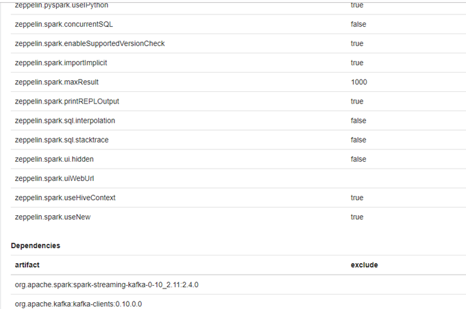

Go to Spark interpreter, under dependencies add the below entries as per
image. This is needed to connect o kafka and import statements to work
from zeppelin spark interpreter.

org.apache.spark:spark-streaming-kafka-0-10\_2.11:2.4.0

org.apache.kafka:kafka-clients:0.10.0.0

For multiple spark sessions to run, enable multiple session to true.

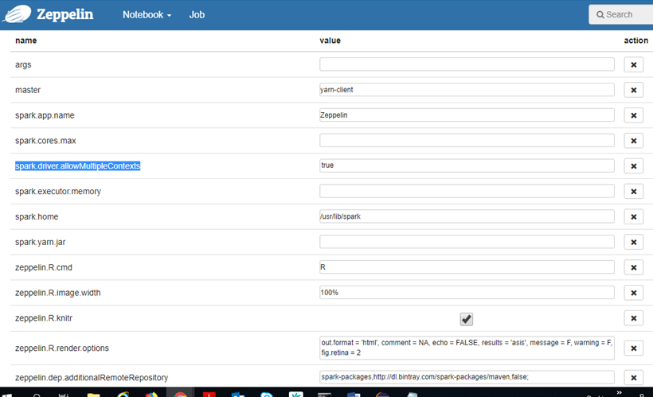

**Run Streaming Code in Zeppelin.** 
-------------------------------------------------

This is a sample word count program where kafka consumer is run with the
spark streaming and reads the kafka messages and prints words.

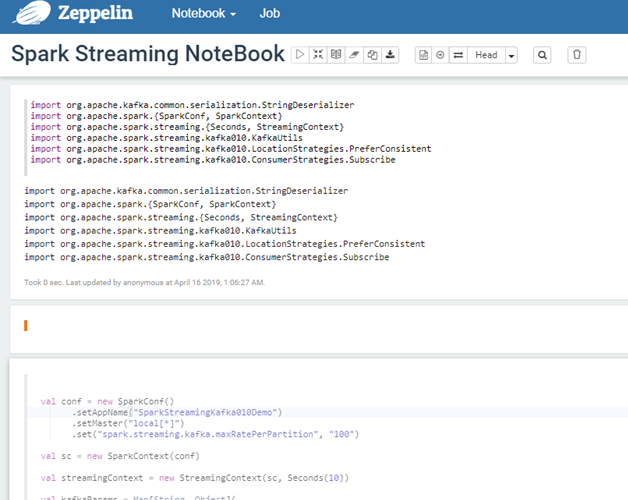

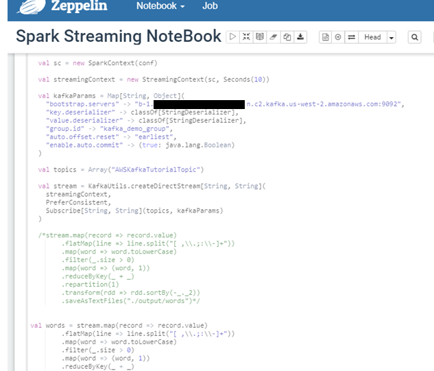

Spark context is up and running.

Lets send sample input form console producer and verify tha data in
zeppelin console

For the console producer to work, kafka download in the step 5 is pre
requisite.

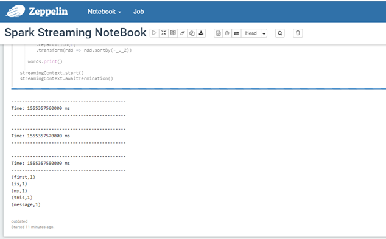

Alternative to zeppelin submit via spark shell

**Submitting the job via Spark shell**
----------------------------------------------------

You can use spark examples and use sparksubmit command also to test the
above

Step 7 jar files are needed to run. You can either pass jar file in
command prompt or as a maven project. As we are using existing example,
passing in command prompt.

spark-submit \--class
org.apache.spark.examples.streaming.JavaDirectKafkaWordCount \--master
yarn-client \--jars
/usr/lib/spark/examples/jars/\*.jar,/home/hadoop/kafka\_2.11-2.1.0/libs/\*.jar,/home/hadoop/spark-streaming-kafka\_2.11-2.4.0.jar
\--num-executors 1 \--driver-memory 512m \--executor-memory 512m
\--executor-cores 1 spark-examples\*.jar
b-2.f3q7nz429i3uooyl3wy41sjin.c2.kafka.us-west-2.amazonaws.com:9092,b-1.f3q7nz429i3uooyl3wy41sjin.c2.kafka.us-west-2.amazonaws.com:9092,b-3.f3q7nz429i3uooyl3wy41sjin.c2.kafka.us-west-2.amazonaws.com:9092
groupid AWSKafkaTutorialTopic

**Output**
------------------------

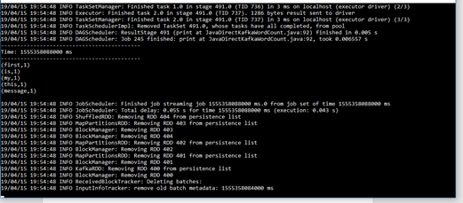

Cloud formation template 
------------------------

Sample cloud formation template to create an EMR cluster and submit
spark step 

This CF has been added with additional SG. Ensure these SG for
master/slave are updated with entry from MSK security group for the
Kafka port.

Also it has a reference to install Kafka client and download some Kafka
and spark streaming libraries in the bootstrap action which is bundled
in the install script and needs to be placed in the referenced s3
location. 

**Conclusion**
============================

With Kafka offered as a Managed service on AWS, users can focus more on
the consumption part instead of worrying on managing the coordination
between the brokers which usually needs a detailed understanding of
kafka. Features like leader selection/in synch replica brokers
availability could be managed by the MSK platform. Users can then focus
on processing layer to consume data from MSK and further propagate to
visualization layer.

## License

This library is licensed under the MIT-0 License. See the LICENSE file.
